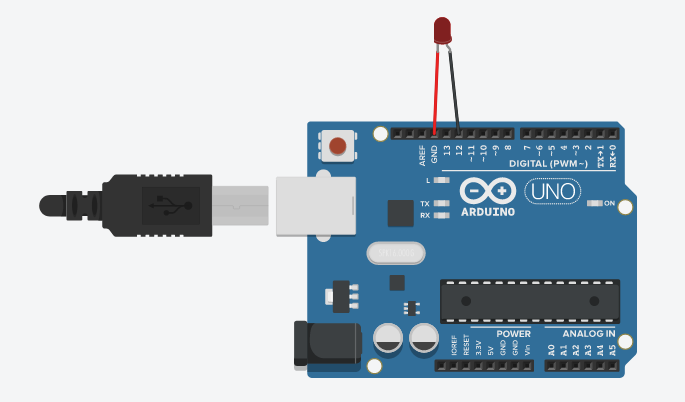

## Acender o led com a mão
### Objetivo
Com esse projeto tenho o objetivo de estudar a implemtantação 
de python + opencv + cvzone e arduino.

### Funcionamento
#### Arduino

Com o led ligado no pino 12, como diagrama, toda vez que recebe um 
"a" pelo serial ele é apagado e toda vez que recebe um "b" ele acende.

### Codigo
Com o uso do opencv e do cvzone toda vez que ele detecta que os dedos 4 
(polegar) e 8 (indicador) estão com a aproximação menor que 35 ele acende 
o led mandando para o serial o char "b", se não manda um "a" que é desligado. 

